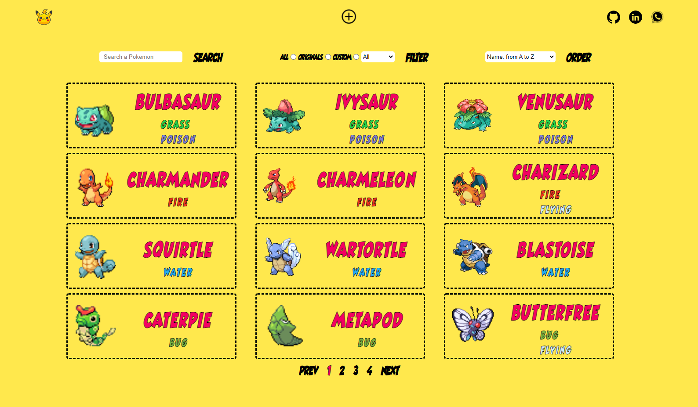
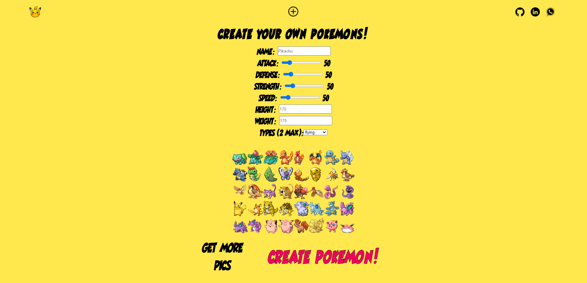

<p align='left'>
    
</p>

# Individual Project - Henry Pokemon

<p align="left">
  
</p>

### Desktop Screen Shot

<p align="left">
  
</p>

## Enunciado

Crear una aplicación utilizando la api externa pokeapi y a partir de ella poder, entre otras cosas:

- Buscar pokemons
- Filtrarlos / Ordenarlos
- Crear nuevos

<p align="left">
  
</p>

Utilizar Postgres como base de datos para persistir Pokemones creados.

## Objetivos del Proyecto

- Construir una App utlizando React, Redux, Node y Sequelize.
- Afirmar y conectar los conceptos aprendidos en la carrera.
- Aprender mejores prácticas.
- Aprender y practicar el workflow de GIT.

#### Tecnologías utilizadas:

- [ ] **React**
- [ ] **Redux**
- [ ] **Sass**
- [ ] **Express**
- [ ] **Sequelize - Postgres**

<p align="left">
  
  
</p>
## BoilerPlate

El boilerplate cuenta con dos carpetas: `api` y `client`. En estas carpetas estará el código del back-end y el front-end respectivamente.

En `api` crear un archivo llamado: `.env` que tenga la siguiente forma:

```
DB_USER=usuariodepostgres
DB_PASSWORD=passwordDePostgres
DB_HOST=localhost
```

Reemplazar `usuariodepostgres` y `passwordDePostgres` con tus propias credenciales para conectarte a postgres. Este archivo va ser ignorado en la subida a github, ya que contiene información sensible (las credenciales).

Adicionalmente será necesario que creen desde psql una base de datos llamada `pokemon`

El contenido de `client` fue creado usando: Create React App.

### Únicos Endpoints/Flags utilizados

- GET https://pokeapi.co/api/v2/pokemon
- GET https://pokeapi.co/api/v2/pokemon/{id}
- GET https://pokeapi.co/api/v2/pokemon/{name}
- GET https://pokeapi.co/api/v2/type

#### Frontend

**Pagina inicial**:

- [ ] Alguna imagen de fondo representativa al proyecto
- [ ] Botón para ingresar al home (`Ruta principal`)

**Ruta principal**:

- [ ] Input de búsqueda para encontrar pokemons por nombre (La búsqueda será exacta, es decir solo encontrará al pokemon si se coloca el nombre completo)
- [ ] Área donde se verá el listado de pokemons. Al iniciar deberá cargar los primeros resultados obtenidos desde la ruta `GET /pokemons` y deberá mostrar su:
  - Imagen
  - Nombre
  - Tipos (Electrico, Fuego, Agua, etc)
- [ ] Botones/Opciones para filtrar por tipo de pokemon y por pokemon existente o creado por nosotros
- [ ] Botones/Opciones para ordenar tanto ascendentemente como descendentemente los pokemons por orden alfabético y por fuerza
- [ ] Paginado para ir buscando y mostrando los siguientes pokemons, 12 pokemons por pagina.

**Ruta de detalle de Pokemon**:

- [ ] Los campos mostrados en la ruta principal para cada pokemon (imagen, nombre y tipos)
- [ ] Estadísticas (vida, fuerza, defensa, velocidad)
- [ ] Altura y peso

**Ruta de creación**:

- [ ] Un formulario **controlado con JavaScript** con los campos mencionados en el detalle del Pokemon
- [ ] Posibilidad de seleccionar/agregar más de un tipo de Pokemon
- [ ] Botón/Opción para crear un nuevo Pokemon

#### Base de datos

Modelos:

- [ ] Pokemon con las siguientes propiedades:
  - ID (Número de Pokemon) \* : No puede ser un ID de un pokemon ya existente en la API pokeapi
  - Nombre \*
  - Vida
  - Fuerza
  - Defensa
  - Velocidad
  - Altura
  - Peso
- [ ] Tipo con las siguientes propiedades:
  - ID
  - Nombre

La relación entre ambas entidades debe ser de muchos a muchos ya que un pokemon puede pertenecer a más de un tipo y, a su vez, un tipo puede incluir a muchos pokemons.

#### Backend

**IMPORTANTE**: No se han utilizado los filtrados, ordenamientos y paginados brindados por la API externa. Todas estas funcionalidades furon implementadas desde React.

- [ ] **GET /pokemons**:
  - Obtener un listado de los pokemons desde pokeapi.
  - Debe devolver solo los datos necesarios para la ruta principal
- [ ] **GET /pokemons/{idPokemon}**:
  - Obtener el detalle de un pokemon en particular
  - Debe traer solo los datos pedidos en la ruta de detalle de pokemon
  - Tener en cuenta que tiene que funcionar tanto para un id de un pokemon existente en pokeapi o uno creado por ustedes
- [ ] **GET /pokemons?name="..."**:
  - Obtener el pokemon que coincida exactamente con el nombre pasado como query parameter (Puede ser de pokeapi o creado por nosotros)
  - Si no existe ningún pokemon mostrar un mensaje adecuado
- [ ] **POST /pokemons**:
  - Recibe los datos recolectados desde el formulario controlado de la ruta de creación de pokemons por body
  - Crea un pokemon en la base de datos
- [ ] **GET /types**:
  - Obtener todos los tipos de pokemons posibles
  - En una primera instancia deberán traerlos desde pokeapi y guardarlos en su propia base de datos y luego ya utilizarlos desde allí
